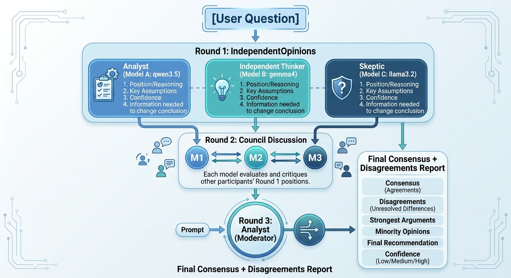

# AI Council

**A multi-model deliberation experiment — v0.1.1**

`ai-council` convenes three different local Ollama models to discuss a question, challenge each other's reasoning, and produce a consensus report. It is an experimental prototype built to answer one question:

> Does structured disagreement between different LLMs produce a more reliable conclusion than simply asking one LLM?

No web server. No cloud services. No agent frameworks. Just three local models, a transparent council protocol, and a transcript that reads as well in a browser as it does in a terminal.

---

## How It Works



*The council workflow: three independent opinions → structured discussion → moderator's consensus report.*

```
User question
      ↓
Round 1 — Three independent opinions (models see only the question)
      ↓
Round 2 — Council discussion (each model sees and critiques the others' arguments)
      ↓
Moderator — One model synthesizes the final report
      ↓
Consensus + Disagreements + Strongest Arguments + Minority Opinion
```

### Round 1 — Independent Opinions

The exact same question is sent to all three models **independently**. No model sees another model's response. Each model answers from its role-specific perspective:

1. Recommendation / position
2. Reasoning
3. Important assumptions
4. Confidence level
5. What information could change its conclusion

### Round 2 — Council Discussion

Each model is then shown the other participants' Round 1 responses and asked to critique the discussion: points of agreement and disagreement, factual disputes, logical weaknesses, assumptions worth examining, and whether its own position was changed, modified, or maintained.

### Round 3 — Moderator / Consensus Report

One model (the Analyst) acts as moderator after completing its participant role. It receives the original question plus all Round 1 and Round 2 responses and produces the final report:

- **Consensus** — what all or most participants agree on
- **Disagreement** — important unresolved differences
- **Strongest Arguments** — which arguments appear strongest and why
- **Minority Opinion** — a meaningful minority position, preserved if one exists
- **Final Recommendation** — the moderator's best overall conclusion
- **Confidence** — Low / Medium / High, with an explanation

### The Core Principle: Evaluate Reasoning, Not Votes

The council deliberately does **not** implement majority voting. `2 YES vs 1 NO → YES wins` is not sufficient — a minority argument may be correct. The moderator is explicitly instructed:

> Do not manufacture consensus. If significant disagreement remains, say so explicitly.

---

## Council Members (defaults)

| Model             | Role                | Temperament |
| ----------------- | ------------------- | ----------- |
| `qwen3.5:9b`      | Analyst             | Technically/logically strongest answer: facts vs. assumptions, trade-offs |
| `gemma4:latest`   | Independent Thinker | Avoids conventional wisdom, considers overlooked options |
| `llama3.2:latest` | Skeptic             | Hunts hidden assumptions, challenges unsupported claims, considers failure cases |

The models intentionally differ in size and capability. The largest model is not assumed to be automatically correct. All model names are configurable — see [Configuration](#configuration).

Responses are **streamed live** to the terminal as each model generates — the label `[Model — Role]` appears as soon as the first token arrives. Note that the first response from each model includes model load time (tens of seconds for larger models), and reasoning models like `qwen3.5` spend time on hidden thinking before their visible answer; their `<think>` spans are hidden from the display and the transcript.

Models run **sequentially, not concurrently**, to minimize memory pressure on a 32 GB Apple M1.

---

## Requirements

- macOS (developed on Apple M1 / 32 GB RAM, but any machine with enough RAM works)
- Python 3.10+
- [Ollama](https://ollama.com) installed and running locally

Pull the required models:

```bash
ollama pull qwen3.5:9b
ollama pull gemma4:latest
ollama pull llama3.2:latest
```

## Installation

```bash
git clone https://github.com/simagix/ai-council.git
cd ai-council

# Homebrew Python is externally managed — use a project venv
python3 -m venv .venv
.venv/bin/pip install -e .

# optionally, make `ai-council` available as a global command
ln -sf "$(pwd)/.venv/bin/ai-council" /opt/homebrew/bin/ai-council   # macOS (Homebrew)

ai-council --version    # -> ai-council v0.1.1
python ai_council.py --version    # -> ai-council v0.1.1
```

No installation is required either — run the launcher directly:

```bash
python ai_council.py "Should I buy 256GB or 512GB for my Mac mini?"
python ai_council.py --version        # -> ai-council v0.1.1
```

## Usage

Ask a one-off question:

```bash
python ai_council.py "Should I buy 256GB or 512GB for my Mac mini?"
```

Or run interactively (multi-line questions supported — end with `Ctrl-D`):

```bash
python ai_council.py
```

```
AI Council

Enter your question:
>
```

### Question files (`use_cases/`)

Real questions usually carry a lot of context. Put the question, its
background, and your constraints in a text/Markdown file — the whole file
is sent verbatim to every council member:

```bash
python ai_council.py --file use_cases/mac-mini-storage.md
cat my-question.md | python ai_council.py --file -    # read from stdin
```

See [`use_cases/README.md`](use_cases/README.md) for the recommended file
shape and `use_cases/mac-mini-storage.md` for a worked example.

Every session is saved as a transcript. By default you get a
self-contained HTML page with a timestamped name (e.g.
`out/council-20260901-094709.html`), so repeated runs never overwrite each
other; `--md` saves readable Markdown instead (defaults to `out/` unless
you give a path), and `--html FILE` picks the name. The two flags can
be used together:

```bash
python ai_council.py "Should I buy 256GB or 512GB?"            # out/council-<timestamp>.html
python ai_council.py "Should I buy 256GB or 512GB?" --md council.md
python ai_council.py "Should I buy 256GB or 512GB?" --html council.html
python ai_council.py "Should I buy 256GB or 512GB?" --md council.md --html council.html
```

The HTML page is a single self-contained file — inline CSS only, no
scripts, no external assets — so it can be opened directly in any
browser, emailed, or dropped into a static site. Markdown from the
question file and model outputs is rendered to real HTML (headings,
lists, bold/italic/code, blockquotes), and everything is escaped, so
model output can never inject markup.

---

## Configuration

Model names and settings live in one place (`config.py`) so they can be changed without touching the core logic. Every value can be overridden with environment variables:

| Variable | Meaning | Default |
| --- | --- | --- |
| `AI_COUNCIL_OLLAMA_HOST` | Ollama API base URL | `http://localhost:11434` |
| `AI_COUNCIL_TIMEOUT` | Per-request timeout in seconds | `600` |
| `AI_COUNCIL_MODEL_ANALYST` | Model for the Analyst role | `qwen3.5:9b` |
| `AI_COUNCIL_MODEL_THINKER` | Model for the Independent Thinker role | `gemma4:latest` |
| `AI_COUNCIL_MODEL_SKEPTIC` | Model for the Skeptic role | `llama3.2:latest` |
| `AI_COUNCIL_MODERATOR` | Model acting as Round 3 moderator | `qwen3.5:9b` |

For example, to run a quick, low-memory council using only Llama 3.2:

```bash
AI_COUNCIL_MODEL_ANALYST=llama3.2:latest \
AI_COUNCIL_MODEL_THINKER=llama3.2:latest \
AI_COUNCIL_MODEL_SKEPTIC=llama3.2:latest \
AI_COUNCIL_MODERATOR=llama3.2:latest \
python ai_council.py "question"
```

---

## Architecture

Deliberately small and modular — the orchestration is built by hand so the council protocol stays transparent and easy to experiment with.

```
ai-council/
├── README.md
├── VERSION               # single source of truth: "0.1.1"
├── pyproject.toml
├── ai_council.py         # launcher / main entry: python ai_council.py ... / --version
├── cli.py                # argument parsing, interactive input, transcript display, --md/--html rendering
├── council.py            # orchestrates Round 1 → Round 2 → Moderator → report
├── ollama.py             # local Ollama API client (stdlib urllib); errors and timeouts
├── prompts.py            # all system prompts and discussion prompts in one place
├── models.py             # CouncilMember(name, model, role, role_key) representations
├── config.py             # model names and basic settings; env-var overrides
└── tests/
```

**Dependencies:** zero at runtime — Python's standard library only; the local Ollama API is accessed directly over HTTP. No LangChain, CrewAI, AutoGen, or any agent framework.

## Development

Run the test suite (uses a fake Ollama client — no Ollama needed):

```bash
python3 -m unittest discover -s tests
```

---

## Error Handling

Failures are reported clearly — the council never silently substitutes a model or pretends a member participated.

- **Ollama not running:**
  ```
  Cannot connect to Ollama.

  Make sure Ollama is running and try again.
  ```
- **Model not installed:**
  ```
  Model not found: qwen3.5:9b

  Install it with:

  ollama pull qwen3.5:9b
  ```
- **Member failure mid-session:** the failure is called out in the transcript rather than treated as a contribution.

---

## Non-Goals (v0.1)

- Web UI
- Authentication
- Cloud model APIs
- Persistent or vector databases
- RAG
- Autonomous agents, tool calling
- Parallel model execution
- Automatic model selection
- Agent frameworks

## Roadmap (future possibilities)

Deliberately not implemented yet, but the architecture keeps the door open:

- Cloud participants: ChatGPT, Gemini, Claude
- More Ollama models, different council roles
- More debate rounds; user participation mid-discussion
- Interactive web interface; session history; consensus scoring
- Evidence/research phase, fact-checker and devil's advocate participants

## Development Philosophy

This is an experiment in multi-model deliberation. The implementation is kept intentionally small so the council protocol can be changed and re-run easily. The first milestone — *question → 3 independent opinions → discussion → moderator → consensus + disagreement + minority opinion* — is the whole of v0.1.
